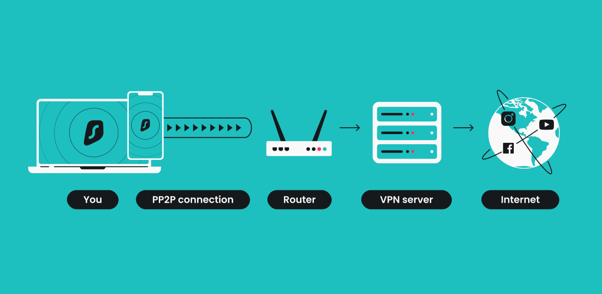

# 🗂️ **PPP Chap VPN - Portfolio Technique**

[](https://www.cisco.com/) [](https://tools.ietf.org/html/rfc4301) [](https://tools.ietf.org/html/rfc1661) [](https://en.wikipedia.org/wiki/Virtual_private_network)



---

## 📄 **Description**

Ce dépôt contient les configurations et les étapes pratiques réalisées dans le cadre d’un TP sur la mise en œuvre d’un VPN sécurisé basé sur **PPP** et **IPsec**. Ce projet explore la sécurisation des connexions via des tunnels VPN et la configuration de protocoles tels que **PPP**, **IPsec**, et **ISAKMP**.  

Le projet met en lumière les techniques de sécurisation des données, les processus de négociation des clés, et l’utilisation des ACL pour contrôler le trafic réseau.

---

## 📁 **Contenu du Dépôt**

- **`configs/`** : Fichiers de configuration des routeurs et équipements.
- **`captures/`** : Captures d’écran des étapes clés du TP.
- **`topologie/`** : Diagrammes et schémas réseau.
- **`debug_logs/`** : Logs des débogages pour IPsec et ISAKMP.
- **`.gitignore`** : Liste des fichiers/dossiers à exclure de Git.
- **`README.md`** : Documentation détaillée.

---

## 🌐 **Technologies Utilisées**

- **PPP** : Protocole de communication pour établir la connexion WAN.  
- **IPsec** : Sécurisation des données avec chiffrement et authentification.  
- **ISAKMP** : Gestion de la négociation et de l’établissement des SA.  
- **ACL** : Contrôle du trafic réseau avec des règles définies.  
- **GNS3** : Simulateur réseau utilisé pour les tests et la validation.

---

## 🚀 **Mise en Route**

### 1. **Cloner le dépôt**

```bash
git clone https://github.com/votre_nom_utilisateur/ppp-chap-vpn.git
cd ppp-chap-vpn
```

### 2. **Importer la topologie dans GNS3**

Chargez le fichier de topologie GNS3 disponible dans le dossier `topologie/`. Configurez les routeurs en utilisant les fichiers de configuration situés dans `configs/`.

### 3. **Tester la connexion**

Utilisez les commandes suivantes sur les routeurs pour tester et déboguer la configuration :

```bash
ping [adresse_destination]
debug crypto isakmp
debug crypto ipsec
```

---

## 🧰 **Personnalisation**

- **Topologie** : Adaptez la topologie réseau en fonction de vos besoins dans le fichier `topologie/`.
- **Fichiers de configuration** : Modifiez les configurations des routeurs dans `configs/` pour tester différentes scénarios VPN.
- **ACL** : Ajustez les listes de contrôle d'accès pour définir les règles de sécurité spécifiques à votre infrastructure.

---

## 📝 **Étapes du TP**

1. **Création de la Topologie** : Mise en place des connexions PPP entre les routeurs.  
2. **Configuration des ACL** : Définition des règles pour le trafic chiffré.  
3. **Configuration d’ISAKMP et IPsec** : Négociation des clés et établissement des tunnels sécurisés.  
4. **Tests et Débogage** : Validation de la connectivité et sécurisation des données via des commandes *ping* et des outils de débogage.  

---

## 🟩 **Licence**

Ce projet est sous licence MIT. Consultez le fichier [LICENSE](LICENSE) pour plus d’informations.

---

### 🗓 **Date de Création**

Janvier 2025
